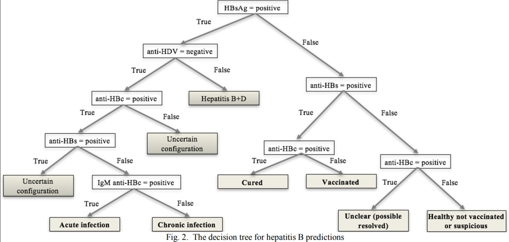

# HepatitisBClips

## Repository Tugas Besar 2 - IF3170 - Inteligensi Buatan - 2022
Repositori ini merupakan implementasi bentuk decision tree di bawah ini dalam bahasa CLIPS. Decision tree ini merupakan decision tree yang digunakan untuk melakukan prediksi kondisi pasien terkait hepatitis B. 

<br>
Program akan meminta masukan dari pengguna mengenai fakta-fakta atau kondisi-kondisi yang dibutuhkan sesuai decision tree di atas. Input yang diharapkan adalah ```positive``` atau ```negative```.
## Run Program
Buka CLIPSIDE, kemudian set directory menjadi ```src```. Program dapat dieksekusi menggunakan command berikut: 
```shell
(load main.clp)
(reset)
(run)

```
## Anggota Kelompok
| NIM | Nama |
| - | -|
| 13520032 | Fadil Fauzani |
| 13520089 | Nayotama Pradipta |